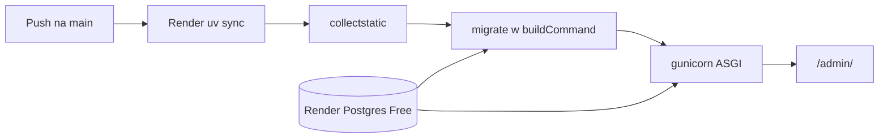

# Pierwsze wdrożenie na Render

Przygotować szkielet Django do pierwszego deploju na Render na **darmowym** compute (web Free + Postgres Free) i przeprowadzić wdrożenie przez Blueprint. Cron FR-008 zostaje na później. Płatny Hobby compute (Starter + basic-256mb) jest kolejnym krokiem, nie tym.

Cel: **żywy Django admin na Render**, z darmowym Postgresem i auto-deployem po merge/push na `main`. Nadal bez tutorialowego `build.sh` + pip i bez `STATICFILES_STORAGE`. **Wyjątek od kontraktu w** [`infrastructure.md`](../../foundation/infrastructure.md): na razie świadomie używamy `plan: free`.

Stan dziś: lokalny `/admin/` działa (SQLite, `DEBUG = True` poza Render). W repo są produkcyjne zależności, `render.yaml` (web Free + Postgres Free, Frankfurt) i ustawienia pod `RENDER`. Czeka commit/push i Blueprint apply.

Koszt teraz: **$0**. Workspace Hobby jest darmowy; darmowe są też instancje web i Postgres. Nie dodawaj karty, dopóki nie przejdziesz na płatny compute.

## Kroki

- [x] **0. Konto Render (Ty):** rejestracja, workspace Hobby, GitHub, darmowy compute — szczegóły poniżej
- [x] **Zależności produkcyjne (agent):** `uv add gunicorn uvicorn "whitenoise[brotli]" "psycopg[binary]" dj-database-url`
- [x] **Ustawienia Django (agent):** produkcyjne `DataCollector/settings.py` — `RENDER` / `DEBUG` / `SECRET_KEY` / `ALLOWED_HOSTS` / CSRF, Postgres URL, WhiteNoise, `STORAGES`, `STATIC_ROOT`, `TIME_ZONE=Europe/Warsaw`
- [x] **Blueprint (agent):** dodać `render.yaml` — web `free` + Postgres `free`, `uv sync --frozen`, migracje w `buildCommand`, bez cron / previews / `preDeployCommand`
- [x] **Gitignore i AGENTS.md (agent):** dopisać `staticfiles/` i `.env` do `.gitignore`; zaktualizować wzmiankę o `render.yaml` w `AGENTS.md`
- [x] **Smoke lokalny (agent):** `check`, `migrate`, `collectstatic`, `runserver` `/admin/`
- [x] **Commit i push (po zgodzie):** wypchnąć na GitHub (PR #3 merged to `main`)
- [x] **Blueprint apply (Ty):** Dashboard → New → Blueprint → to repo / `main` → obie instancje **Free** (`https://datacollector-n0w9.onrender.com`)
- [x] **Weryfikacja i superuser:** `/admin/login/` 200 z CSS (WhiteNoise); logowanie superuserem zostaje po Twojej stronie

## Poza zakresem tego wdrożenia

- Cron FR-008 (nie ma jeszcze management command; dodamy przy zapisie cen; cron na Render i tak nie jest darmowy)
- GitHub Actions (auto-deploy robi Render; CI testów później)
- Docker, PR preview environments, domena custom
- Płatny compute (Starter / basic-256mb) — upgrade, gdy dane mają przeżyć 30 dni
- Must-have produktowe poza tym, że `/admin/` ma działać

---

## 0. Konto Render — co kliknąć (Ty, bez doświadczenia)

Ten punkt możesz zrobić **teraz**, równolegle z pracą agenta. **Nie** twórz jeszcze Web Service ani Postgres ręcznie — aplikację podepniemy później przez Blueprint (krok 7), gdy w repo będzie `render.yaml`.

Oficjalny start: [Your First Render Deploy](https://render.com/docs/your-first-deploy). Nasz wariant: GitHub + Blueprint, nie pojedynczy „New → Web Service”.

### 0.1 Załóż konto

1. Otwórz [https://dashboard.render.com/register](https://dashboard.render.com/register).
2. Kliknij **GitHub** (ten sam login co repo [MartBur/Data-collector](https://github.com/MartBur/Data-collector)). Nie używaj **Cursor Origin** (u Rendera jest beta).
3. Jeśli GitHub zapyta o uprawnienia Rendera — zatwierdź. Po powrocie jesteś w Dashboard.

Konto e-mail + hasło też działa, ale i tak musisz potem podłączyć GitHub (krok 0.3).

### 0.2 Zostań na Hobby, nic nie płać

Render ma dwa „plany”, które łatwo pomylić:

| Co | Wybór teraz | Znaczenie |
| --- | --- | --- |
| **Workspace** (abonament platformy) | **Hobby** | $0/mies. dla jednej osoby. Nie wybieraj Pro ($25). |
| **Compute** (każda usługa / baza) | **Free** | $0. Web zasypia; Postgres wygasa po 30 dniach. |

1. Jeśli Dashboard pyta o workspace — **Hobby**.
2. **Nie** dodawaj karty. Render pobiera $1 weryfikacyjny przy karcie; do Free nie jest potrzebna.
3. Jeśli zobaczysz „Upgrade” / Pro — zamknij. Upgrade workspace **nie** zmienia Free compute na płatny (to osobna decyzja przy każdej usłudze).

### 0.3 Podłącz GitHub (jeśli logowałeś się inaczej)

Dashboard już mógł to zrobić przy rejestracji przez GitHub. Sprawdź:

1. Kliknij avatar (prawy górny róg) → **Account Settings**.
2. Sekcja **Account Security** → **Git Deployment Credentials**.
3. Jeśli GitHub już jest na liście — OK.
4. Jeśli nie: **Add credential** → **GitHub** → autoryzuj.

Gdy GitHub pyta, do których repozytoriów Render ma dostęp:

- Wybierz **Only select repositories** (nie „All repositories”).
- Zaznacz **`MartBur/Data-collector`**.
- Zatwierdź instalację GitHub App **Render**.

Bez tego Blueprint nie zobaczy repo.

### 0.4 Region i nazewnictwo (na później, w Blueprint)

Nic tu nie klikasz teraz. W `render.yaml` ustawimy region **Frankfurt** (bliżej PL). Nazwa serwisu (np. `datacollector`) wejdzie w URL: `https://datacollector.onrender.com`.

### 0.5 Czego nie klikaj w Dashboard

- **New → Web Service** / **New → Postgres** — pomiń. Ręczne tworzenie rozjedzie się z Blueprint.
- **New → Cron Job** — poza zakresem i płatne.
- **Cursor Origin** jako Git provider.
- **Free** jest OK na tym etapie; **nie** wybieraj Starter/Standard, dopóki nie chcesz płacić.
- Nie wklejaj z tutoriala Django na Render: `build.sh`, `pip install -r requirements.txt`, `plan: free` z ich `requirements.txt` — nasz stack to **uv** + `uv.lock`.

### 0.6 Limity Free — zaakceptowane na pierwszy deploy

To nie jest produkcja. Świadomie:

- **Web** po 15 minutach bez ruchu **zasypia**. Pierwsze wejście budzi serwis ~**1 minutę** (strona ładowania Rendera). Lokalny SQLite na dysku instancji i tak by zniknął — dane trzymamy w Postgres.
- **Postgres Free:** 1 GB, **jedna** darmowa baza na workspace, **bez backupów**, wygasa po **30 dniach**. Potem 14 dni na upgrade; potem Render **kasuje dane**.
- Render może zrestartować web i bazę w dowolnym momencie.
- **750 godzin** Free web / miesiąc (uśpiony serwis nie liczy się). Hobby: 5 GB transferu, 500 min. buildów.
- Na Free web **nie ma**: Shell (Dashboard), SSH, **one-off jobs** (`render jobs create`), `preDeployCommand`, dysku. Dlatego migracje idą w `buildCommand`, a superuser z zmiennych `DJANGO_SUPERUSER_*`, nie z Shell.
- `WEB_CONCURRENCY=1` (Free to 0.1 CPU / 512 MB).

Przypomnienie w kalendarzu ok. 3 tygodni po utworzeniu bazy: upgrade Postgres albo świadoma utrata danych.

### 0.7 Co oznacza „gotowe” po tym punkcie

Masz konto, Hobby, GitHub z dostępem tylko do `Data-collector`. Dashboard może być pusty (zero serwisów) — tak ma być. Blueprint (krok 7) robisz **po** tym, jak `render.yaml` będzie na `main`.

---

## 1. Zależności produkcyjne (agent)

W katalogu repo: `uv add gunicorn uvicorn "whitenoise[brotli]" "psycopg[binary]" dj-database-url` — zaktualizuje [`pyproject.toml`](../../../pyproject.toml) i [`uv.lock`](../../../uv.lock). Bez `requirements.txt` i bez `build.sh`.

## 2. Ustawienia Django pod Render (agent)

Zmiany tylko w [`DataCollector/settings.py`](../../../DataCollector/settings.py) (plik wygenerowany — bez pełnego retro-typowania; nowe helpery jeśli powstaną: z adnotacjami, bez `Any`).

Gdy w środowisku jest `RENDER` (Render ustawia to sam):

- `DEBUG = False`
- `SECRET_KEY` z env (Blueprint `generateValue: true`); lokalnie zostaje obecny `django-insecure-…`
- `ALLOWED_HOSTS` i `CSRF_TRUSTED_ORIGINS` z `RENDER_EXTERNAL_HOSTNAME`
- `DATABASES` z `DATABASE_URL` przez `dj_database_url` + SSL; lokalnie bez `DATABASE_URL` zostaje SQLite
- `TIME_ZONE = "Europe/Warsaw"` (kalendarzowe „dziś” z NFR / FR-008)
- WhiteNoise zaraz po `SecurityMiddleware`
- `STATIC_ROOT = BASE_DIR / "staticfiles"`
- Django 6 `STORAGES["staticfiles"]` = `whitenoise.storage.CompressedStaticFilesStorage` (nie tutorialowy `STATICFILES_STORAGE`, nie Manifest — mniej 500 przy admin CSS)

Lokalnie nadal: `uv run python manage.py runserver` + SQLite.

## 3. Blueprint `render.yaml` w korzeniu (agent)

Nie kopiować pipowego `build.sh`. Szkic pod **Free**:

- Postgres: `plan: free`. Jedna darmowa baza na workspace.
- Web: `runtime: python`, `plan: free`, region `frankfurt`
- **Bez** `PYTHON_VERSION` — [`.python-version`](../../../.python-version) ma `3.14`
- **Bez** `previews` (Hobby nie klonuje DB; ryzyko migracji na tej samej bazie)
- **Bez** `preDeployCommand` — na Free go nie ma
- `buildCommand`: `uv sync --frozen && uv run python manage.py collectstatic --no-input && uv run python manage.py migrate && (uv run python manage.py createsuperuser --noinput || true)`  
  (`|| true` tylko wokół `createsuperuser`, żeby drugi deploy nie wywalił buildu, gdy user już istnieje — bez nawiasów `|| true` połknęłoby też błąd `migrate`)
- `startCommand`: `uv run python -m gunicorn DataCollector.asgi:application -k uvicorn.workers.UvicornWorker --bind 0.0.0.0:$PORT`
- Env: `DATABASE_URL` z `fromDatabase.connectionString`, `SECRET_KEY` `generateValue: true`, `WEB_CONCURRENCY=1`
- `DJANGO_SUPERUSER_USERNAME`, `DJANGO_SUPERUSER_EMAIL`, `DJANGO_SUPERUSER_PASSWORD` z `sync: false` (wpiszesz je w Dashboard przy apply — nie w gicie)
- `healthCheckPath`: `/admin/login/`

Jeśli `uv sync --frozen` spróbuje zbudować pakiet `workspace` (`uv_build` + [`src/workspace/`](../../../src/workspace/__init__.py)) i padnie: dodać `--no-dev --no-install-project`.

## 4. Gitignore (agent)

Dopisać do [`.gitignore`](../../../.gitignore): `staticfiles/`, `.env` i `db.sqlite3`.

Jedna linia w [`AGENTS.md`](../../../AGENTS.md): jest `render.yaml`; auto-deploy nadal Render, nie Actions.

## 5. Smoke lokalny (agent)

- `uv run python manage.py check`
- `uv run python manage.py migrate` (SQLite)
- `uv run python manage.py collectstatic --no-input`
- `uv run python manage.py runserver` — `/admin/` działa jak wcześniej

## 6. Commit i push na GitHub (po Twojej zgodzie)

Repo: https://github.com/MartBur/Data-collector. Render czyta Blueprint z gałęzi po pierwszym apply. Bez commita Dashboard nie zobaczy `render.yaml`.

## 7. Pierwszy Blueprint (Ty — Dashboard, po kroku 6)

Render **nie ma** `blueprint apply` w CLI. Kolejność kliknięć:

1. Zaloguj się na [https://dashboard.render.com](https://dashboard.render.com).
2. Prawy górny róg: **New** → **Blueprint** (nie Web Service).
3. Na liście repo znajdź **Data-collector** → **Connect**. Jeśli listy nie ma — wróć do 0.3.
4. **Blueprint Name:** np. `datacollector`. **Branch:** `main`. **Blueprint Path:** zostaw puste (`render.yaml` w korzeniu).
5. Render pokaże podgląd: web + Postgres. Przy obu wybierz / potwierdź **Free**. Jeśli pyta o region i yaml nie wygra — **Frankfurt**.
6. Gdy zapyta o zmienne z `sync: false` (`DJANGO_SUPERUSER_*`), wpisz login, e-mail i **silne** hasło admina. Tego hasła nie commituj.
7. **Deploy Blueprint**. Czekaj: provisioning bazy → build (`uv sync`, collectstatic, migrate) → start gunicorn. Pierwszy build bywa 5–10 min.
8. Status **Live**. URL będzie w stylu `https://<nazwa>.onrender.com`.

CLI jest opcjonalne i **nie** potrzebne do pierwszego deploju. Później: `winget install render.cli`, `render login`. Automatyzacja: `CI=true` / `-o json --confirm`, token `RENDER_API_KEY`.

## 8. Weryfikacja i superuser

- W Dashboard otwórz serwis web → **Logs** (albo **Events**). Szukaj udanego `migrate` i startu gunicorn. Błąd `bind` / port = startCommand.
- Otwórz `https://<nazwa>.onrender.com/admin/login/`. **Pierwsze wejście na Free może trwać ~1 minutę** (spin-up).
- Zaloguj się danymi z kroku 7. CSS admina ma być widoczny (WhiteNoise).
- Na Free **nie** używamy `render jobs create` ani Shell — ich po prostu nie ma.
- Po pierwszym udanym logowaniu możesz usunąć `DJANGO_SUPERUSER_PASSWORD` ze zmiennych serwisu (Dashboard → Environment), żeby hasło nie leżało w env na stałe.

## Pułapki

- Tutorial Django na Render: `build.sh` + pip — Render wtedy **nie** robi native `uv sync`. Nasz `buildCommand` zaczyna się od `uv sync --frozen`.
- Ręczne **New → Web Service** obok Blueprint — dwa źródła prawdy.
- Auto PR preview wskazujące na ten sam Free Postgres.
- Druga ścieżka auto-deploy w GitHub Actions (duplikat Render).
- Cron bez FR-008 (puste runy; cron i tak płatny).
- `preDeployCommand` / `render jobs create` na Free — niedostępne; stąd migrate i createsuperuser w `buildCommand`.
- Free Postgres po 30+14 dniach **kasuje historię cen**. Zanim pojawią się prawdziwe dane FR-008, upgrade do `0.1c-256mb` (~$6/mies.).
